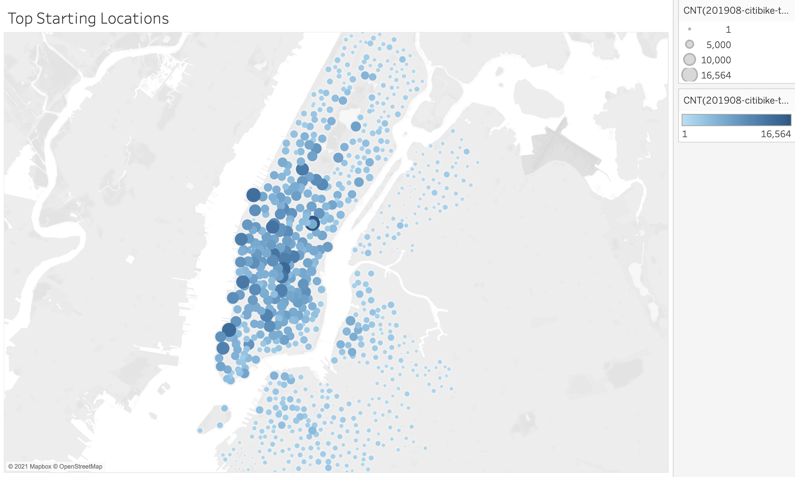
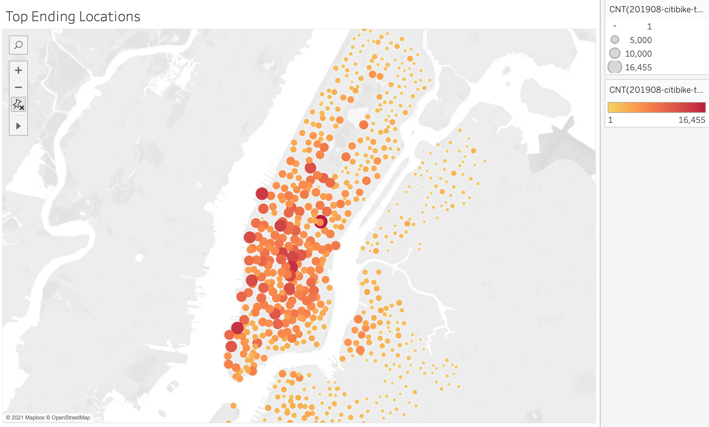
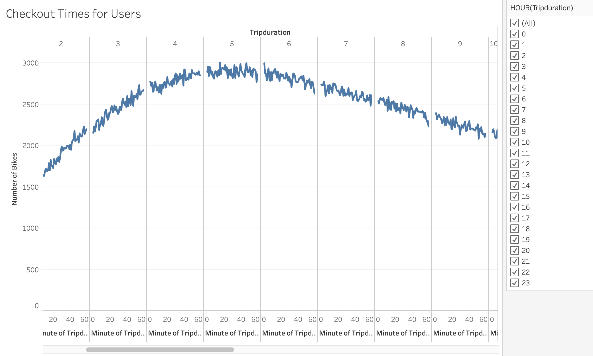
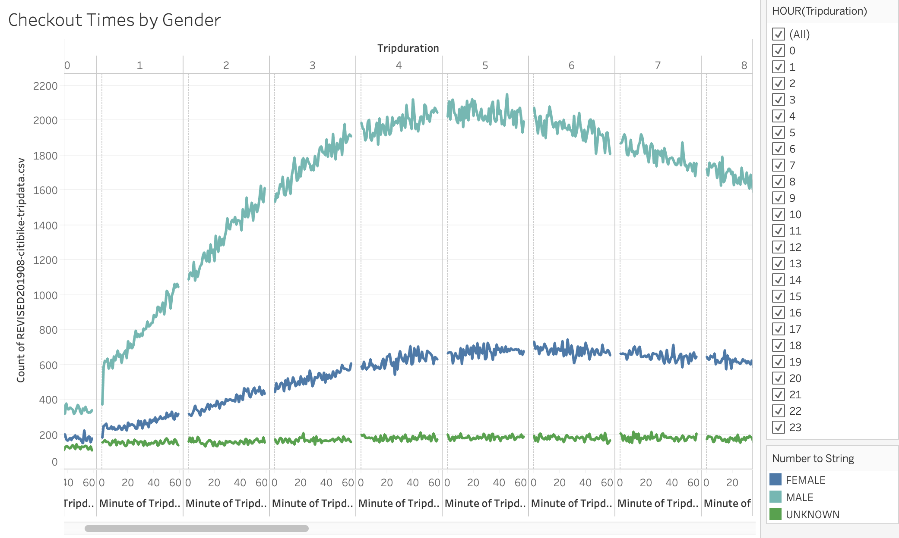
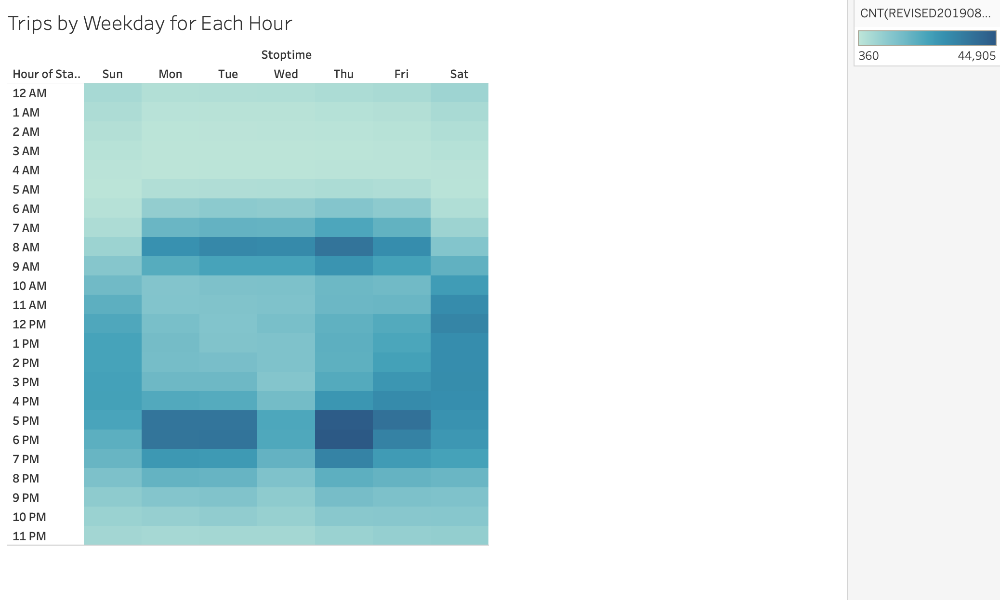
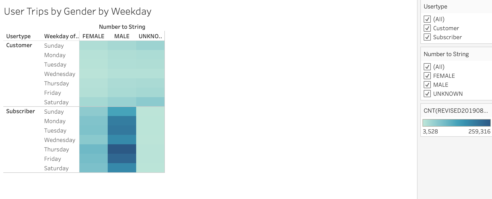

# bikesharing

## Overview

After submitting data to an angel investors, they were still not convinced that a bike sharing business would thrive in Des Moinse. We are asked to provide a bike trip analysis. The following information will take a deeper look at the consumers utilizing the bike share service in New York and hopefully persuade our investors that this is a viable business opportunity.

## Results

I was unable to upload my data file to GitHub because the file was too large, however, the following screen shots/results will speak for themselves. To view the Tableau Story created for this project, please visit: 
* [Bike Sharing Project - Tableau Story](https://public.tableau.com/profile/eric.meneses#!/vizhome/Module14_CitiBikeAnalysis/Module14_Challenge?publish=yes)

### Top Starting and Ending locations

In both the Top Starting and Ending locations, we can see that Brooklyn reularly uses the bike share system to travel within the vecinity. It may be due to tourists, but there is a high probability it could be due to local use as well. We will dig deeper into the data to assess what the case may be.

### Checkout Times for Users

We found that the highest trip duration among consumers utilizing the bike sharing service is betweem 3-7 hours. 

### Checkout Times by Gender

In our findings, we have found that men are 2-3 times more likely to utilize the bike sharing service.

### Trips by Weekday for Each Hour

When we assess the data by hour, we see that the work week tends to have higher usage of the bike sharing service between 7-10am and again from 5-8pm. While on the weekends, there seem to be a steady usage throughout the day from 9am-8pm. It is safe to say that the reason the traffic is higher in the two time blocks during the work week is due to the local work commute whereas the weekend is more likely due to leisurly activities.

### Trips by Gender (Weekday per Hour)

1.png)
2.png)

When we separate the trips by gender, we don't see a change in consumer usage by hour the hour. Our previous theory still stands that local consumers are utilizing the bike share service to commute for work during the work week and on weekends for leisurly activities. When we examine the UNKNOWN gender data, we see that the weekends have a higher usage. This may be due to tourists or visitors utilizing the bike share service. We can assume that the UNKNOWN users are Customers (people that are not regular users) as oppose to Subscribers (people that regularly use the bike share service).

### User Trips by Gender by Weekday

As previously mentioned, Subscribers are regular users. This information is vital to our research because give the above data, this proves that local use for commuting to work is more successful that relying on toursits and vistors.

